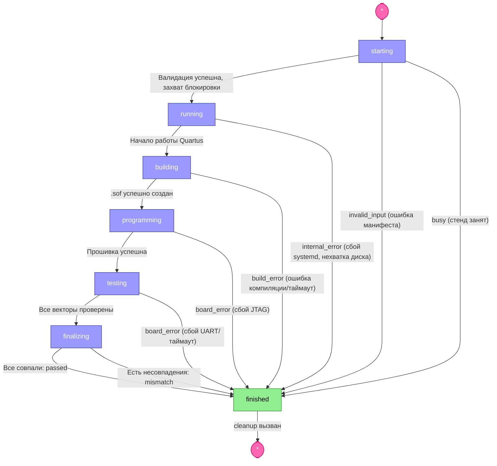

# Диаграмма состояний

```mermaid
flowchart TD
    Start([*]) --> starting["starting"]
    
    starting -->|"Валидация успешна, захват блокировки"| running["running"]
    
    running -->|"Начало работы Quartus"| building["building"]
    building -->|".sof успешно создан"| programming["programming"]
    programming -->|"Прошивка успешна"| testing["testing"]
    testing -->|"Все векторы проверены"| finalizing["finalizing"]
    
    finalizing -->|"Все совпали: passed"| finished["finished"]
    finalizing -->|"Есть несовпадения: mismatch"| finished
    
    %% Аварийные переходы
    starting -->|"invalid_input (ошибка манифеста)"| finished
    starting -->|"busy (стенд занят)"| finished
    
    building -->|"build_error (ошибка компиляции/таймаут)"| finished
    programming -->|"board_error (сбой JTAG)"| finished
    testing -->|"board_error (сбой UART/таймаут)"| finished
    
    running -->|"internal_error (сбой systemd, нехватка диска)"| finished
    
    finished -->|"cleanup вызван"| End([*])
    
    %% Стилизация
    classDef state fill:#9999ff,stroke:#333399,color:white
    classDef terminal fill:#ff66b2,stroke:#cc0066,color:white
    classDef success fill:#90ee90,stroke:#228b22,color:black
    classDef mismatch fill:#ffd700,stroke:#b8860b,color:black
    
    class starting,running,building,programming,testing,finalizing state
    class Start,End terminal
    class finished success
```